# MERNBookSearch
A MERN App for searching google books and then saving books that you may want to read.

Enter information about a book and search the **Google Books** API for books to read from the API's *volumes*.   If Books are found using the criteria, they are displayed with: 
* Title of the book.
* The book's author(s). 
* The book's description.
* The book's thumbnail image. 

Selecting to *View* the book will redirect to a new window to the **Google Books .&TM** site for that particular Book.

Select to *Save* the book where the book will be added to the *MongoDb* for later reference.

*Search* or view the *Saved* books as you wish with the navigation links at the top of the page. 

# Author 
> Tim Shaffer

## Contents
* [Deployment](#deployment)
* [Tech Used](#tech-used)
* [File Structure](#folder-structure)
* [Instructions](#instructions)

## Deployment
The app is deployed to **Heroku** at the following link:  https://ts-mernbooksearch.herokuapp.com/

## Tech Used
* MongoDb
* Express
* React.js 
* Node.js
    * axios
    * if-env
    * mongoose
    * react
    * react-dom
    * react-scripts
    * react-router-dom
* HTML 
* CSS
* Bootstrap
* JavaScript

* This project was bootstrapped with [Create React App](https://github.com/facebook/create-react-app).
    * More information can be found in the `\client\React-README.md`

### Folder Structure

```bash
📦MERNBookSearch
┃  📦client
┃  ┃  📦node_modules
┃  ┃  📦public
┃  ┃  ┣ 📜favicon.ico
┃  ┃  ┣ 📜index.html
┃  ┃  ┗ 📜manifest.json
┃  ┃  📦src
┃  ┃  ┣ 📂components
┃  ┃  ┃ ┣ 📂DeleteBtn
┃  ┃  ┃ ┃ ┣ 📜index.js
┃  ┃  ┃ ┃ ┗ 📜style.css
┃  ┃  ┃ ┣ 📂Footer
┃  ┃  ┃ ┃ ┣ 📜index.js
┃  ┃  ┃ ┃ ┗ 📜style.css
┃  ┃  ┃ ┣ 📂Form
┃  ┃  ┃ ┃ ┗ 📜index.js
┃  ┃  ┃ ┣ 📂Grid
┃  ┃  ┃ ┃ ┣ 📜index.js
┃  ┃  ┃ ┃ ┗ 📜style.css
┃  ┃  ┃ ┣ 📂Header
┃  ┃  ┃ ┃ ┣ 📜index.js
┃  ┃  ┃ ┃ ┗ 📜style.css
┃  ┃  ┃ ┣ 📂Jumbotron
┃  ┃  ┃ ┃ ┗ 📜index.js
┃  ┃  ┃ ┣ 📂List
┃  ┃  ┃ ┃ ┣ 📜index.js
┃  ┃  ┃ ┃ ┗ 📜style.css
┃  ┃  ┃ ┣ 📂Navbar
┃  ┃  ┃ ┃ ┣ 📜index.js
┃  ┃  ┃ ┃ ┗ 📜style.css
┃  ┃  ┃ ┣ 📂SaveBtn
┃  ┃  ┃ ┃ ┣ 📜index.js
┃  ┃  ┃ ┃ ┗ 📜style.css
┃  ┃  ┃ ┣ 📂Saved
┃  ┃  ┃ ┃ ┗ 📜index.js
┃  ┃  ┃ ┣ 📂Search
┃  ┃  ┃ ┃ ┣ 📜index.js
┃  ┃  ┃ ┃ ┗ 📜style.css
┃  ┃  ┃ ┣ 📂ViewBtn
┃  ┃  ┃ ┃ ┣ 📜index.js
┃  ┃  ┃ ┃ ┗ 📜style.css
┃  ┃  ┃ ┗ 📂Wrapper
┃  ┃  ┃ ┃ ┗ 📜index.js
┃  ┃  ┣ 📂pages
┃  ┃  ┃ ┗ 📜NoMatch.js
┃  ┃  ┣ 📂utils
┃  ┃  ┃ ┗ 📜API.js
┃  ┃  ┣ 📜App.css
┃  ┃  ┣ 📜App.js
┃  ┃  ┣ 📜App.test.js
┃  ┃  ┣ 📜index.css
┃  ┃  ┣ 📜index.js
┃  ┃  ┣ 📜logo.svg
┃  ┃  ┗ 📜registerServiceWorker.js
┃  ┃  📜.env
┃  ┃  📜package-lock.json
┃  ┃  📜package.json
┃  ┃  📜React-README.md
┃  📦controllers
┃   ┗ 📜books_controller.js
┃  📦models
┃   ┣ 📜book.js
┃   ┗ 📜index.js
┃  📦node_modules
┃  📦routes
┃   ┣ 📂api
┃   ┃ ┣ 📜books.js
┃   ┃ ┗ 📜index.js
┃   ┗ 📜index.js
┃  📜.gitignore
┃  📜package-lock.json
┃  📜package.json
┃  📜README.md
┗  📜server.js

```

# Instructions
  
1. Clicking the **Heroku** link - https://ts-mernbooksearch.herokuapp.com/ - will take you to the page.

    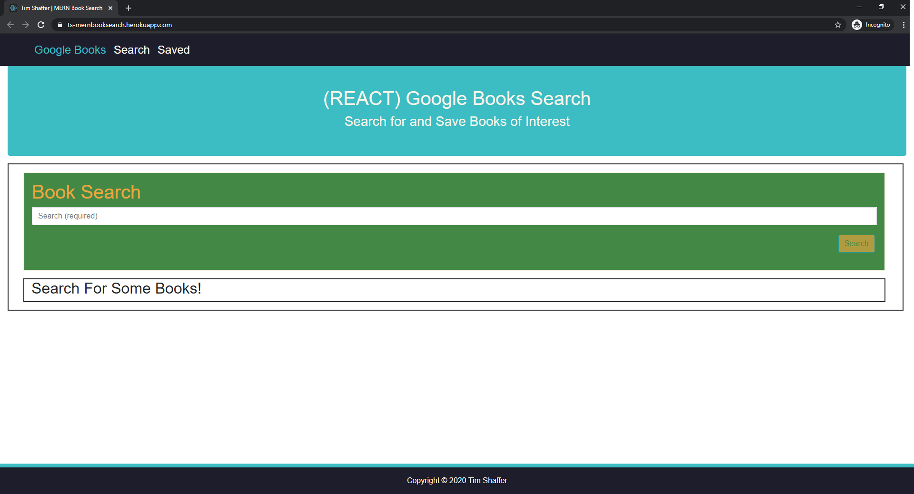

1. The Navigation Links will take the user between pages.

    * Clicking the **Search** link will load the homepage, waiting for a new search.

        

    * Clicking the **Saved** link will access the DB to find any Saved Books and then display those books to the page.  If there aren't any books in the database, it displays a corresponding message.

        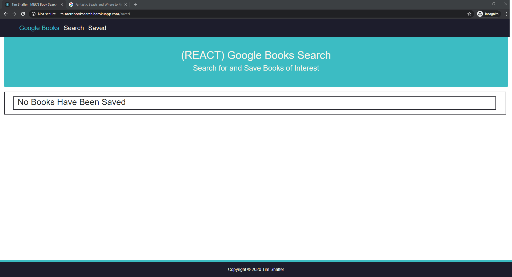

1. From the Homepage, enter information about a book to search and then click the **Search** button.

    

1. The results of the search will be displayed.

    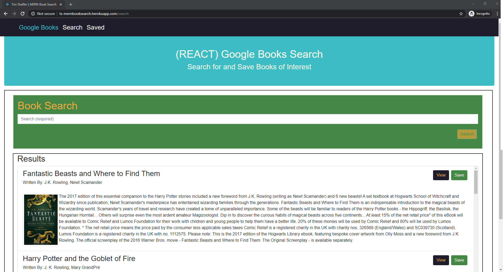

1. Scroll down to see all the results.

    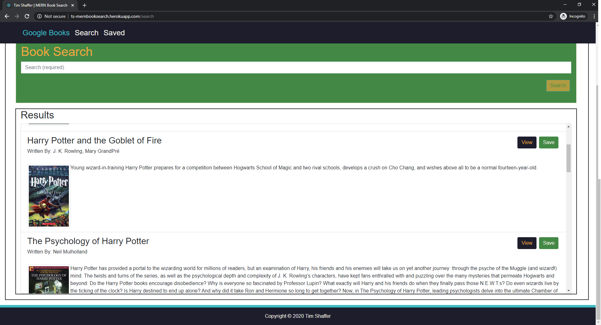
    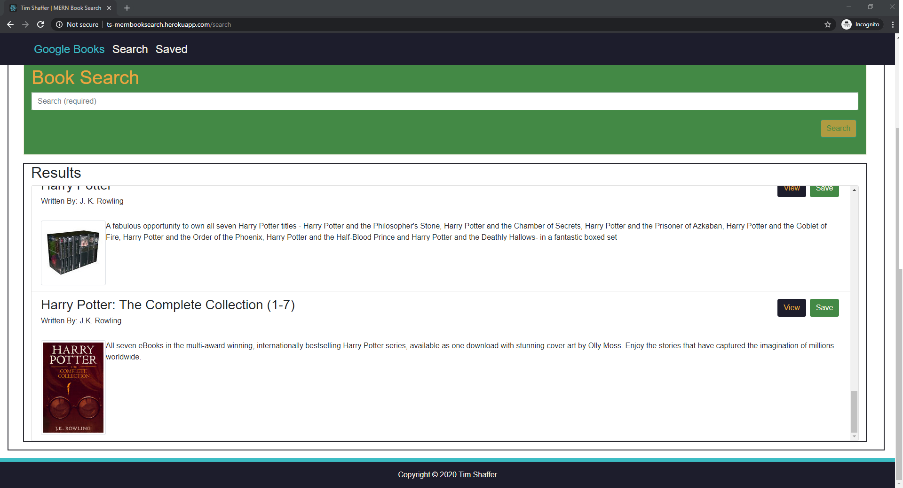
    
1. Each Book in the results has the following:  

    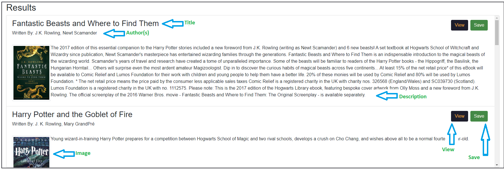

    * The **Title** of the book.
    * **Written By:** listing of the author(s).
    * An **Image** of the book itself.
    * A **Description** of the book.
    * A **View** button that can be clicked that will open a new window with the *Google Books* page for the book.
    * A **Save** button that can be clicked to *Save* the book to the database.  When Saved, the book is removed from the results and can be viewed on the *Saved* books page.

1. Clicking the *View* button for this book will open a new window to the Google Books page for the book.

    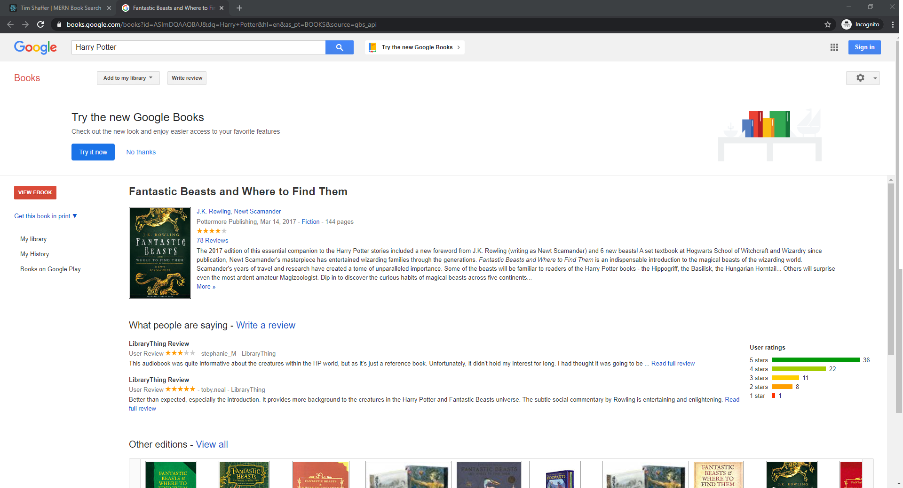

1. Clicking the *Save* button will save the book to the database and remove the book from the results.

    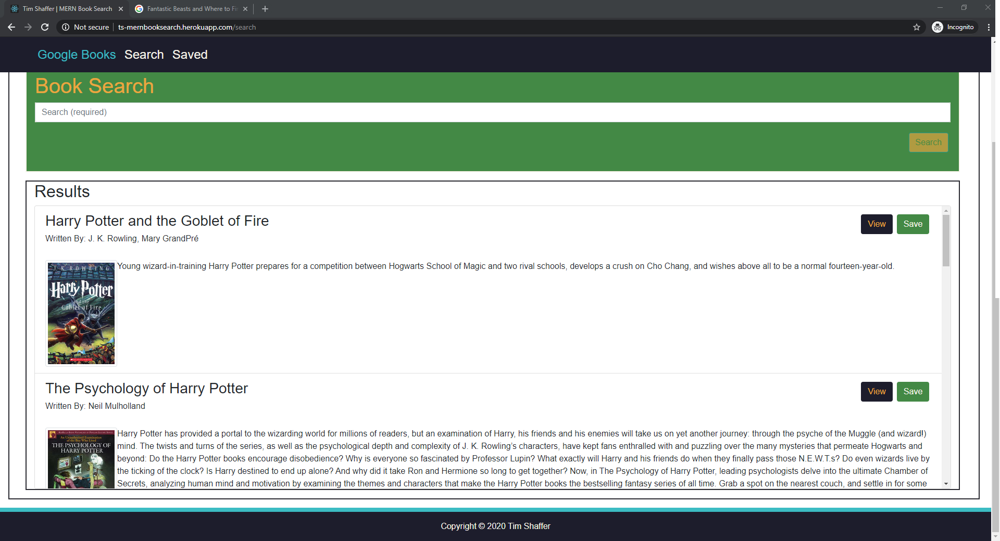

1. Continue to Search, View or Save as desired.  

1. At any point, either in the current session or at a later time, you would like to see the books that were saved, click the **Saved** link in the navigation to be brought to the list of saved books.

    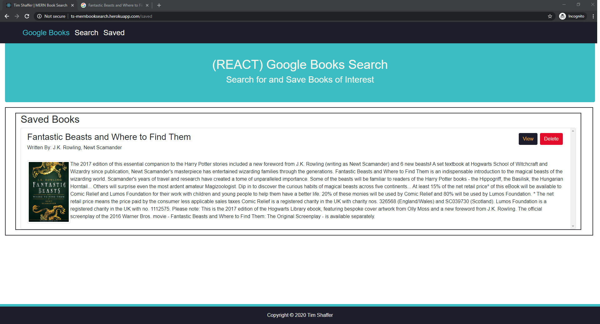

1. If there is more than one book in the database, scroll down to see all the saved books.

    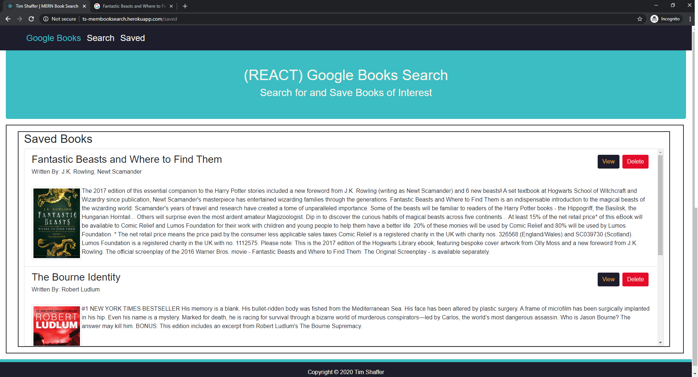
    

1. Each of the Saved Books in the results has the following:  

    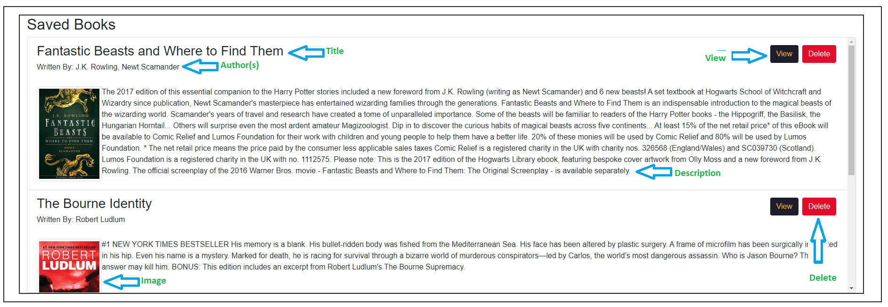

    * The **Title** of the book.
    * **Written By:** listing of the author(s).
    * An **Image** of the book itself.
    * A **Description** of the book.
    * A **View** button that can be clicked that will open a new window with the *Google Books* page for the book.
    * A **Delete** button that can be clicked to *Delete* the book from the database.  When deleted, the book is removed from the results.

1. Clicking the *View* button for this book will open a new window to the Google Books page for the book.

    

1. Clicking the *Delete* boutton will delete the book from the database and remove the book from the display.

    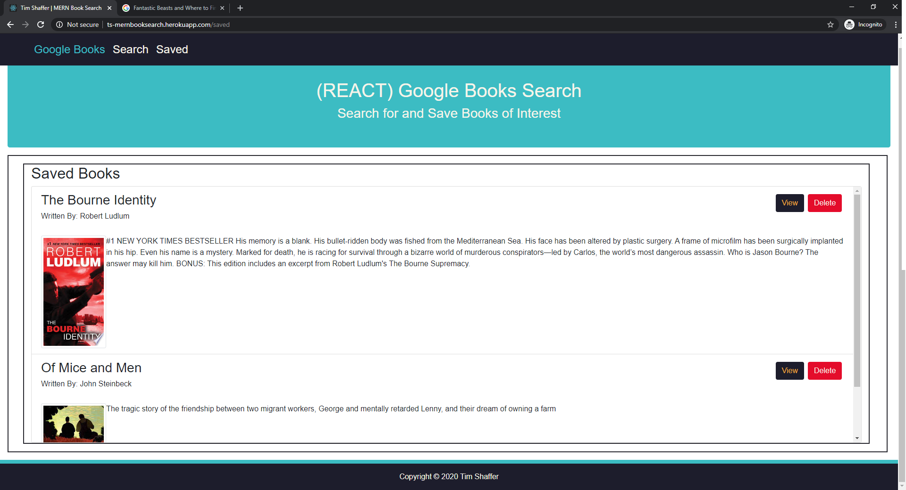

1. Click the **Search** link in the Navigation to continue searching for more books!

    

